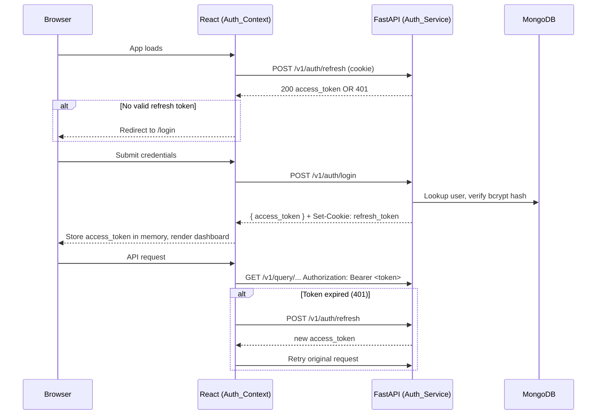

# Design Document: fleet-auth-login

## Overview

This feature adds login-based authentication to the Sentinel fleet management dashboard. The system currently has no access control — any user with network access can view fleet data. This design introduces:

- A login page with credential submission
- JWT-based session management (access token in memory, refresh token in HttpOnly cookie)
- Protected routes on the React frontend
- Authenticated FastAPI endpoints using a reusable dependency
- Automatic silent token refresh with request retry
- Logout with server-side cookie invalidation

The approach uses stateless JWTs for access tokens and HttpOnly cookies for refresh tokens, which balances security (XSS-resistant refresh storage) with simplicity (no server-side session store required for access tokens).

---

## Architecture

The authentication flow follows a standard OAuth2-style token pattern adapted for a single-page application:



### Key Architectural Decisions

- **Access token in memory only**: Prevents XSS token theft from localStorage. Token is lost on page reload, which is recovered via the refresh flow.
- **Refresh token in HttpOnly cookie**: Inaccessible to JavaScript, sent automatically by the browser on `/v1/auth/refresh` calls. The backend sets and clears this cookie.
- **Single refresh mutex**: Concurrent 401 responses trigger only one refresh request; other callers queue and reuse the result.
- **React Router v6 for routing**: The existing app uses no router — this design introduces React Router v6 to support `/login` and protected dashboard routes.
- **FastAPI dependency injection**: A `get_current_user` dependency is applied to all protected route groups, keeping auth logic centralized.

---

## Components and Interfaces

### Frontend Components

#### `AuthContext` (`src/auth/AuthContext.tsx`)
React context provider wrapping the entire app. Holds session state and exposes auth actions.

```typescript
interface AuthState {
  accessToken: string | null;
  isAuthenticated: boolean;
  isLoading: boolean; // true during initial refresh attempt on app load
}

interface AuthContextValue extends AuthState {
  login: (username: string, password: string) => Promise<void>;
  logout: () => Promise<void>;
  getAccessToken: () => string | null;
}
```

On mount, `AuthContext` fires a silent `POST /v1/auth/refresh`. While this is in flight, `isLoading` is `true` and the app renders a loading spinner rather than redirecting to `/login` prematurely.

#### `ProtectedRoute` (`src/auth/ProtectedRoute.tsx`)
Wraps dashboard routes. If `isLoading` is true, renders a spinner. If `isAuthenticated` is false, redirects to `/login`.

```typescript
// Usage in router
<Route path="/" element={<ProtectedRoute><App /></ProtectedRoute>} />
<Route path="/login" element={<LoginPage />} />
```

#### `LoginPage` (`src/auth/LoginPage.tsx`)
Standalone page rendered at `/login`. Contains the `LoginForm` component. Redirects to `/` if already authenticated.

#### `LoginForm` (`src/auth/LoginForm.tsx`)
Controlled form component. Manages local state for username, password, loading, and error display.

```typescript
interface LoginFormState {
  username: string;
  password: string;
  isSubmitting: boolean;
  error: string | null;
}
```

Validation runs client-side before submission: both fields must be non-empty (after trimming). On 401 from the backend, the error message from the response body is displayed.

### Frontend Service Layer

#### `authApi` (added to `services/apiService.ts`)

```typescript
interface LoginResponse {
  access_token: string;
  token_type: string;
}

const authApi = {
  login(username: string, password: string): Promise<LoginResponse>,
  refresh(): Promise<LoginResponse>,
  logout(): Promise<void>,
}
```

#### Updated `sentinelApi`
All existing methods gain an `Authorization: Bearer <token>` header injected by `AuthContext`. The `sentinelApi` is updated to accept a token getter function, or the fetch calls are wrapped in an interceptor pattern that reads the token from `AuthContext`.

On receiving a 401, the interceptor calls `authApi.refresh()` once (guarded by a mutex), updates the stored token, and retries the original request. If refresh fails, it calls `AuthContext.logout()`.

### Backend Modules

#### `auth_service.py` (new file in `services/`)

Responsibilities:
- Password hashing and verification via `passlib[bcrypt]`
- JWT creation and validation via `python-jose[cryptography]`
- User lookup from MongoDB
- Refresh token cookie management

```python
# Key functions
def create_access_token(data: dict, expires_delta: timedelta = timedelta(minutes=15)) -> str
def create_refresh_token(data: dict, expires_delta: timedelta = timedelta(days=7)) -> str
def verify_token(token: str) -> dict  # raises HTTPException 401 on failure
def hash_password(plain: str) -> str
def verify_password(plain: str, hashed: str) -> bool
```

#### FastAPI Auth Dependency

```python
async def get_current_user(token: str = Depends(oauth2_scheme)) -> dict:
    """Reusable dependency. Raises HTTP 401 if token is missing or invalid."""
```

Applied to all `/v1/query/*` and `/v1/ingest/*` routers via `dependencies=[Depends(get_current_user)]`.

#### New Auth Endpoints (added to `main.py`)

| Method | Path | Auth Required | Description |
|--------|------|---------------|-------------|
| POST | `/v1/auth/login` | No | Verify credentials, return tokens |
| POST | `/v1/auth/refresh` | No (cookie) | Issue new access token from refresh cookie |
| POST | `/v1/auth/logout` | No | Clear refresh token cookie |

---

## Data Models

### Backend Pydantic Models

```python
class LoginRequest(BaseModel):
    username: str
    password: str

class TokenResponse(BaseModel):
    access_token: str
    token_type: str = "bearer"

class TokenPayload(BaseModel):
    sub: str        # username
    exp: datetime
    iat: datetime
```

### MongoDB User Document

```python
# Collection: "users"
{
  "_id": ObjectId,
  "username": str,          # unique index
  "hashed_password": str,   # bcrypt hash, cost factor >= 12
  "created_at": datetime,
  "is_active": bool
}
```

### TypeScript Types (additions to `types.ts`)

```typescript
export interface AuthUser {
  username: string;
}

export interface LoginCredentials {
  username: string;
  password: string;
}

export interface TokenResponse {
  access_token: string;
  token_type: string;
}
```

### JWT Payload Structure

```json
{
  "sub": "operator_username",
  "exp": 1234567890,
  "iat": 1234567890,
  "type": "access" | "refresh"
}
```

The `type` claim distinguishes access tokens from refresh tokens so a refresh token cannot be used as a bearer token on protected endpoints.

---

## Correctness Properties

*A property is a characteristic or behavior that should hold true across all valid executions of a system — essentially, a formal statement about what the system should do. Properties serve as the bridge between human-readable specifications and machine-verifiable correctness guarantees.*


### Property 1: Unauthenticated users are always redirected

*For any* dashboard route, when the `ProtectedRoute` component renders with `isAuthenticated = false` and `isLoading = false`, the rendered output should redirect to `/login` rather than rendering the protected content.

**Validates: Requirements 1.1**

---

### Property 2: Empty or whitespace credentials are rejected client-side

*For any* combination of username and password where at least one is empty or composed entirely of whitespace, submitting the `LoginForm` should display a validation error and make zero calls to the `/v1/auth/login` endpoint.

**Validates: Requirements 1.4**

---

### Property 3: Valid login returns both tokens

*For any* registered user with a correct password, a POST to `/v1/auth/login` should return a response containing a non-empty `access_token` string and set a `refresh_token` HttpOnly cookie.

**Validates: Requirements 2.2, 3.1**

---

### Property 4: Invalid credentials always return 401

*For any* credential pair where the username does not exist or the password does not match the stored hash, a POST to `/v1/auth/login` should return HTTP 401 with a non-empty error message body.

**Validates: Requirements 2.3**

---

### Property 5: Passwords are stored as bcrypt hashes with cost factor ≥ 12

*For any* user created in the system, the `hashed_password` field stored in MongoDB should be a valid bcrypt hash string whose embedded cost factor is greater than or equal to 12.

**Validates: Requirements 2.5**

---

### Property 6: All authenticated API requests carry a Bearer token

*For any* call made through `sentinelApi` while `AuthContext` holds a non-null access token, the outgoing HTTP request should include an `Authorization` header with the value `Bearer <token>`.

**Validates: Requirements 3.2**

---

### Property 7: Token expiry claims match specification

*For any* access token created by `create_access_token`, the `exp - iat` delta should equal 15 minutes. *For any* refresh token created by `create_refresh_token`, the `exp - iat` delta should equal 7 days.

**Validates: Requirements 3.5**

---

### Property 8: Protected endpoints enforce authentication

*For any* request to a `/v1/query/*` or `/v1/ingest/*` endpoint, the response status should be 401 if and only if the `Authorization: Bearer` header is absent or carries an invalid/expired token.

**Validates: Requirements 4.1, 4.2, 4.3**

---

### Property 9: Concurrent 401 responses trigger exactly one refresh

*For any* number of concurrent API requests that all receive HTTP 401 responses, the `AuthContext` should make exactly one call to `/v1/auth/refresh`, and all original requests should be retried with the new token once the refresh completes.

**Validates: Requirements 6.4, 6.1, 6.2**

---

## Error Handling

### Frontend

| Scenario | Behavior |
|----------|----------|
| Login form submitted with empty fields | Client-side validation error shown; no API call made |
| `/v1/auth/login` returns 401 | Error message from response body displayed below submit button |
| `/v1/auth/login` returns 5xx or network error | Generic "Unable to connect. Please try again." message shown |
| `/v1/auth/refresh` fails on app load | Session set to unauthenticated; redirect to `/login` |
| API request returns 401 (expired token) | Silent refresh attempted; original request retried; on refresh failure, redirect to `/login` |
| Logout API call fails | Session is still cleared locally; user is redirected to `/login` regardless |

### Backend

| Scenario | HTTP Status | Response |
|----------|-------------|----------|
| Missing or malformed `Authorization` header | 401 | `{"detail": "Not authenticated"}` |
| Expired access token | 401 | `{"detail": "Token has expired"}` |
| Invalid token signature | 401 | `{"detail": "Invalid token"}` |
| Wrong username or password | 401 | `{"detail": "Invalid credentials"}` |
| Missing or invalid refresh cookie | 401 | `{"detail": "Invalid or expired refresh token"}` |
| Internal server error | 500 | `{"detail": "Internal server error"}` |

All 401 responses from auth endpoints use the same `WWW-Authenticate: Bearer` header to comply with RFC 6750.

---

## Testing Strategy

### Dual Testing Approach

Both unit tests and property-based tests are required. They are complementary:
- Unit tests cover specific examples, integration points, and error paths
- Property-based tests verify universal correctness across randomized inputs

### Property-Based Testing

**Library**: `hypothesis` (Python) for backend properties; `fast-check` (TypeScript/npm) for frontend properties.

Each property test must run a minimum of **100 iterations**.

Each test must include a comment tag in the format:
`# Feature: fleet-auth-login, Property <N>: <property_text>`

| Property | Test Description | Library |
|----------|-----------------|---------|
| Property 1 | Render ProtectedRoute with any unauthenticated state, assert redirect | fast-check |
| Property 2 | Generate empty/whitespace credential combos, assert no API call + error shown | fast-check |
| Property 3 | Generate valid user credentials, call login endpoint, assert token fields present | hypothesis |
| Property 4 | Generate invalid credential pairs, call login endpoint, assert 401 | hypothesis |
| Property 5 | Generate usernames, create users, inspect stored hash cost factor | hypothesis |
| Property 6 | Generate API calls via sentinelApi with token in context, assert Authorization header | fast-check |
| Property 7 | Generate token payloads, create tokens, decode and check exp-iat delta | hypothesis |
| Property 8 | Generate requests to protected endpoints with valid/invalid/missing tokens, assert 401 iff invalid | hypothesis |
| Property 9 | Simulate N concurrent 401 responses, assert exactly one refresh call and N retries | fast-check |

### Unit Tests

Unit tests focus on specific examples, integration points, and error conditions that are not well-suited to property testing:

**Frontend (Vitest + React Testing Library)**:
- `LoginForm` renders username input, password input, and submit button (Req 1.2)
- `LoginForm` disables submit button and shows spinner while submitting (Req 1.3)
- `LoginForm` displays backend error message on 401 (Req 2.4)
- `AuthContext` fires refresh request on mount when no token in memory (Req 3.3)
- `AuthContext` sets unauthenticated state when refresh fails on mount (Req 3.4)
- `AuthContext` clears token and calls logout endpoint when logout is triggered (Req 5.2)
- `AuthContext` redirects to `/login` after logout regardless of API result (Req 5.3)
- Logout button is visible in dashboard layout when authenticated (Req 5.1)
- Silent refresh retries original request with new token on success (Req 6.2)
- Silent refresh failure redirects to `/login` (Req 6.3)

**Backend (pytest)**:
- `/v1/health` returns 200 without a token (Req 4.4)
- `/v1/auth/login` returns 200 without a token (Req 4.4)
- `/v1/auth/logout` clears the refresh token cookie (Req 5.4)
- `AuthContext` stores access token in memory after successful login (Req 3.1)
- Backend sets HttpOnly flag on refresh token cookie (Req 3.1)
